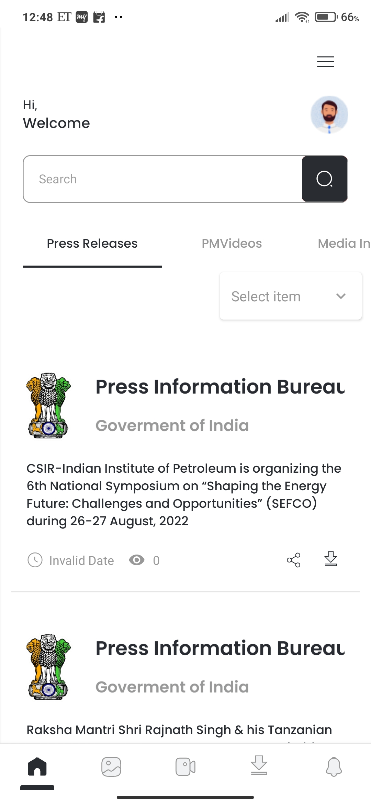
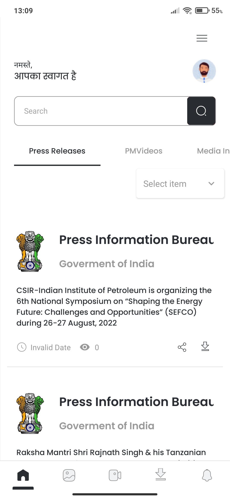
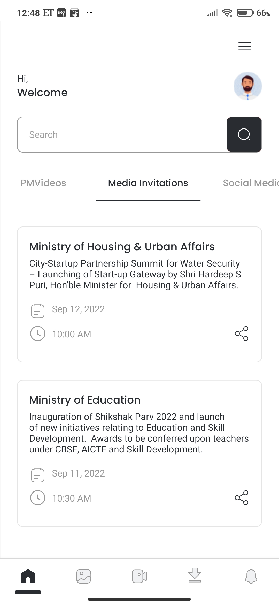
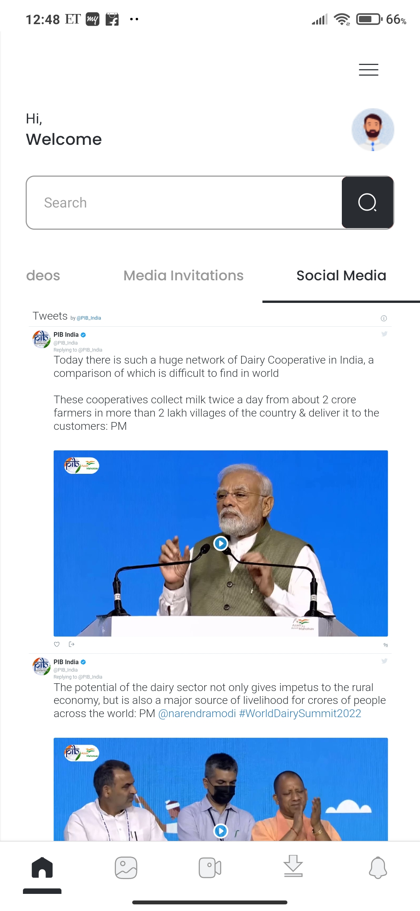
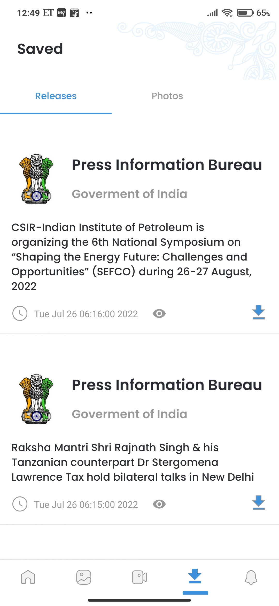
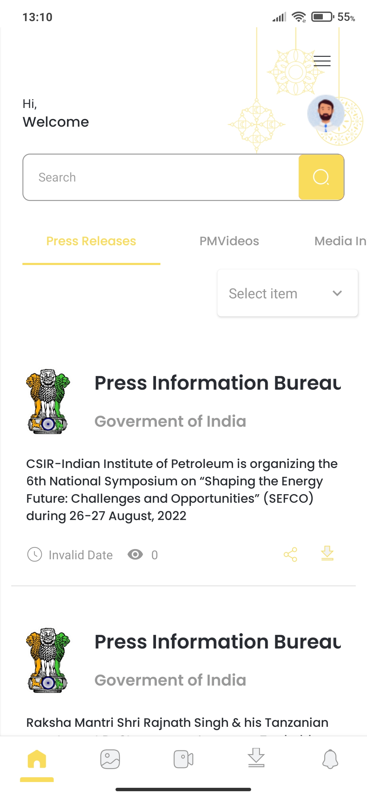
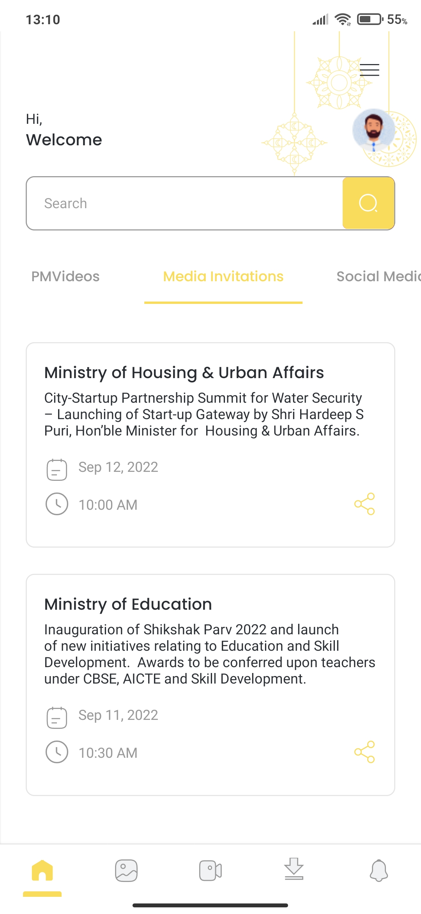
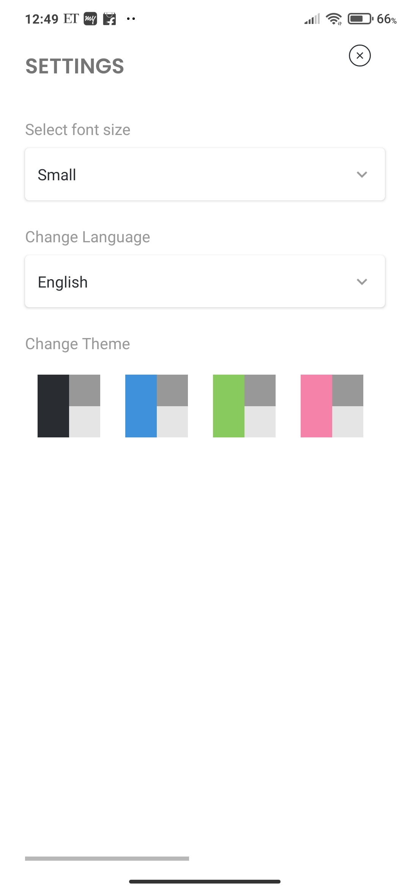
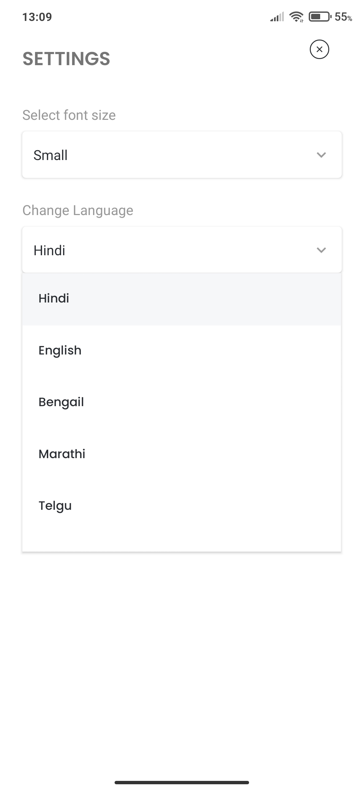

## Mobile Application for Press Information Bureau(PIB)

#### Policy Planning Cell, Ministry of Information & Broadcasting

_This mobile application for PIB was made as a Grand Finale Project for Smart India Hackathon 2022, organised by the Government of India._

### Description

- A real-time and one-stop solution for the latest information about the Government. The app supports various multimedia formats such as text, video, and audio.
- The app can be customized to the language of choice of the user, and his/her topics of interest. A mechanism for real-time notification is provided. The app also contains the feature of live-streaming of important press conferences and other events
- The app made to be interactive and be linked to the PIB’s social media accounts and website. The app also have an engaging user interface and cultural themes.

## Tech Stack

##### Frontend:

 

##### Backend:

    

##### Deployment:

 

## Repo Links

[Frontend](https://github.com/Anuragtech02/sih-client-mobile) |[Backend](https://github.com/Anuragtech02/sih-server)

## Developers

   

## Screenshots

        